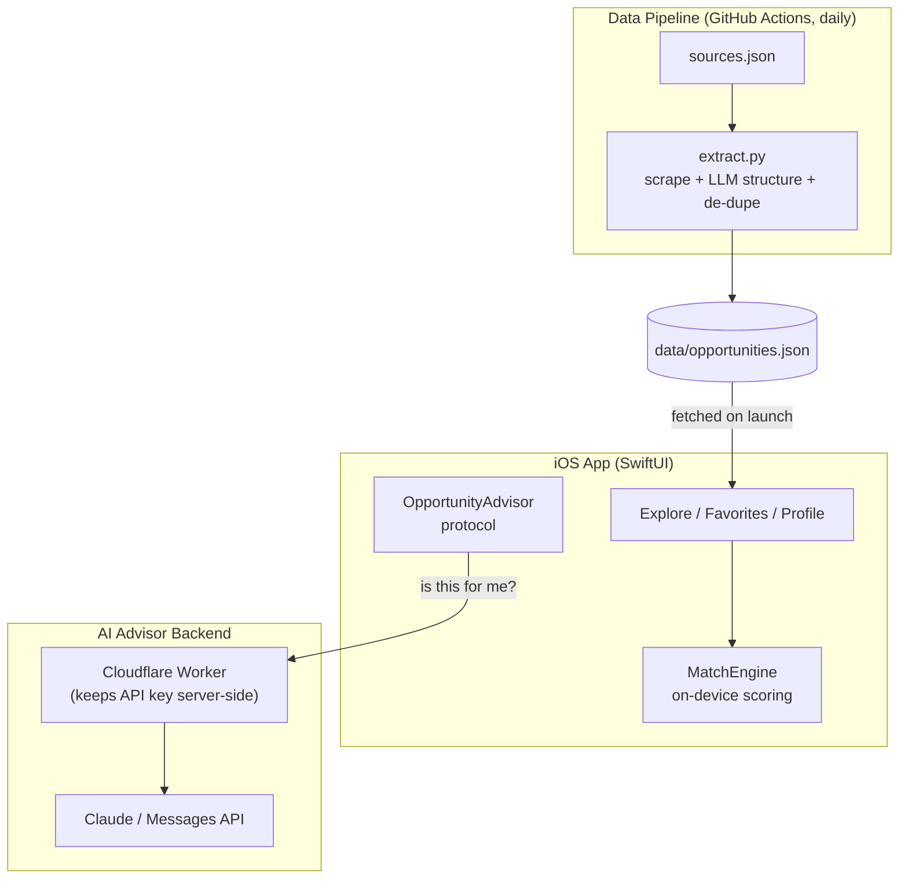

# 青機會 · Youth Opportunity

|                                                       Onboarding                                                       |                                                    Explore                                                    |                                                     Detail · AI Advisor                                                    |                                                      Favorites                                                      |                                                    Profile                                                    |
| :--------------------------------------------------------------------------------------------------------------------: | :-----------------------------------------------------------------------------------------------------------: | :------------------------------------------------------------------------------------------------------------------------: | :-----------------------------------------------------------------------------------------------------------------: | :-----------------------------------------------------------------------------------------------------------: |
| <a href="docs/screenshots/onboarding.png"></a> | <a href="docs/screenshots/explore.png"></a> | <a href="docs/screenshots/detail.png"></a> | <a href="docs/screenshots/favorites.png"></a> | <a href="docs/screenshots/profile.png"></a> |

<sub>點擊圖片查看完整尺寸 · Click screenshots to enlarge</sub>

**繁體中文 ｜ [English](#english)**

---

# 簡介

青機會是一款協助台灣青年探索各類發展機會的 iOS App。

它整合散落在政府、基金會與企業網站上的補助、競賽、獎學金、實習與創業計畫，根據使用者條件進行個人化配對，並導向官方網站完成申請。

青機會定位為「探索與聚合工具」，而非申請平台。

青機會希望解決兩個核心問題：

> **有哪些機會？哪些適合我？**

透過資訊整合與個人化配對，幫助使用者快速找到符合自身條件的青年計畫。

---

# 為什麼做

台灣有大量青年補助、競賽、獎學金與創業計畫，但資訊分散於不同政府機關、基金會與企業網站。

許多機會並不是不存在，而是使用者不知道它們存在，或不知道自己是否符合資格。

青機會希望透過資料整理、個人化推薦與 AI 輔助，降低資訊搜尋成本，讓探索機會變得更簡單。

---

# 功能亮點

## 本機個人化配對

依照使用者的：

* 年齡
* 身分
* 地區

透過本機 Matching Engine 計算適配程度，並顯示：

* 很適合
* 頗適合
* 可考慮

所有推薦運算皆在裝置端完成：

* 不需要 API
* 無需網路
* 即時完成

---

## AI Advisor

提供每個機會的 AI 輔助分析：

> 「這個計畫適合我嗎？」

AI Advisor 使用 Claude API，並透過 Cloudflare Worker 保護 API Key。

同時提供離線模式：

* `BackendAdvisor`：連接 Claude AI
* `MockAdvisor`：使用本地資料產生分析

即使沒有 API Key，App 仍可完整展示。

---

## 自動更新資料管線

建立 Python 自動化 Pipeline：

1. 抓取官方網站資料
2. 使用 LLM 進行結構化整理
3. 移除重複資料
4. 更新 JSON 資料庫
5. GitHub Actions 每日自動執行

App 啟動時取得最新資料，不需要等待 App Store 更新。

---

## 收藏與提醒

支援：

* SwiftData 收藏管理
* 收藏置頂
* 滑動操作
* 截止日前 3 天本地通知提醒

---

## 地圖整合

具有實體地點的計畫會顯示 MapKit 卡片：

* 查看位置
* 開啟 Apple Maps
* 開啟 Google Maps

---

# Architecture

青機會由三個主要部分組成：



---

# 技術架構

## iOS App (MVVM + @Observable)

資料流程：

```
Remote JSON
    ↓
OpportunityService
    ↓
OpportunityStore
    ↓
SwiftUI Views
```

主要模組：

### Models

* `Opportunity`
* `UserProfile`
* `MatchEngine`
* `FavoriteOpportunity`

### Stores

* `OpportunityStore`
* `ProfileStore`
* `AppRouter`

### Services

* `OpportunityService`
* `RecommendationService`
* `ReminderService`

---

# On-device Matching Engine

`MatchEngine.evaluate()` 採用純函式設計。

計算流程：

```
Base Score
    +
Age Requirement Check
    +
Identity / Region Weight
    ↓
Match Level
```

由於所有推薦邏輯在裝置端執行：

* 運算快速
* 無額外 API 成本
* 支援離線使用

---

# AI Advisor Design

透過 Protocol 抽象 AI 功能：

```swift
protocol OpportunityAdvisor {
    func analyze(_ opportunity: Opportunity) async throws -> String
}
```

實作：

### BackendAdvisor

```
iOS App
   ↓
Cloudflare Worker
   ↓
Claude Messages API
```

API Key 不會存在 App 內。

---

### MockAdvisor

離線模式：

* 使用真實資料
* 自動生成建議
* 不需要 API

---

# Tech Stack

| Area          | Technology                        |
| ------------- | --------------------------------- |
| iOS           | Swift, SwiftUI, SwiftData, MapKit |
| Architecture  | MVVM, Observation Framework       |
| AI            | Claude Messages API               |
| Backend Proxy | Cloudflare Workers                |
| Data Pipeline | Python, BeautifulSoup, Gemini     |
| Automation    | GitHub Actions                    |
| Notification  | UserNotifications                 |
| Ads           | Google Mobile Ads                 |
| Target        | iOS 18+, Xcode 16                 |

---

# 專案架構

```
OpportunityMap/
├── Models/
│   └── Opportunity, UserProfile, MatchEngine
│
├── ViewModels/
│   └── OpportunityStore, ProfileStore
│
├── Services/
│   └── Data, AI, Notification Services
│
├── Views/
│   └── Explore, Detail, Favorites, Profile
│
data/
└── opportunities.json

pipeline/
└── extract.py

backend/
└── worker.js

.github/
└── workflows/
```

---

# 執行方式

1. Open:

```
OpportunityMap.xcodeproj
```

with Xcode 16.

2. Build and run on:

```
iOS 18 Simulator
```

No API keys are required.

Default behavior:

* AI Advisor → `MockAdvisor`
* Ads → Google Test IDs

---

# 專案狀態

目前已完成：

✅ Opportunity Discovery<br>
✅ Personalized Matching<br>
✅ AI Advisor Layer<br>
✅ Favorites<br>
✅ Deadline Reminder<br>
✅ Map Integration<br>
✅ Automated Data Pipeline

未來改善:

* 增加更多官方資料來源
* 補充截止日期與補助金額資訊
* 部署正式 Claude Backend
* 優化推薦模型

---

# 免責聲明

青機會僅提供公開青年計畫資訊整理與導流。

所有資格條件與截止日期，請以各計畫官方公告為準。

申請前請務必至官方網站確認最新資訊。

---

<br>

# About Youth Opportunity

An iOS app that helps young people in Taiwan discover grants, competitions, scholarships, internships, and startup programs from various official sources.

The app matches opportunities based on user profiles and redirects users to official websites for application.

It is a discovery and aggregation platform, not an application portal.

Its goal is to answer *"what opportunities exist, and which ones fit me?"* in five minutes, then link out.

> Built with SwiftUI + SwiftData, an on-device eligibility-matching engine, an optional Claude-powered advisor, and a self-updating data pipeline (Python + Gemini + GitHub Actions).

### Why it exists

Taiwan runs hundreds of youth grants, competitions, scholarships and startup programs — but they're scattered across dozens of government, foundation and corporate sites, each with its own format and eligibility often buried in PDFs. Many young people miss opportunities simply because they never knew they existed, or couldn't tell whether they qualified.

Youth Opportunity brings them together in one place, structures the information, and shows users which opportunities actually fit them — so discovering opportunities takes five minutes instead of spending hours searching across multiple websites.

### Highlights

- **On-device personalized matching** — a deterministic engine scores every opportunity against the user's age / identity / region and shows a fit badge (`很適合 / 頗適合 / 可考慮`), fully offline, no network or API needed.
- **AI Advisor (optional)** — a per-opportunity *"is this for me?"* read powered by Claude through a backend proxy, with an offline `MockAdvisor` fallback so the app is always demoable at zero cost.
- **Self-updating data pipeline** - A Python pipeline automatically collects data from official websites, uses LLM-based extraction, removes duplicates, and updates the JSON database through GitHub Actions.
- **Favorites with SwiftData** — pin-to-top, swipe actions, and the same fit badges.
- **Deadline reminders** — local notifications scheduled 3 days before a deadline.
- **Venue map** — opportunities with a physical location show a MapKit card that opens in Apple or Google Maps.

### Architecture

Three cooperating parts around one JSON "database":


- **iOS App (MVVM + `@Observable`)** — data flows one way: remote JSON → `OpportunityService` (fetch remote, fall back to bundled) → `OpportunityStore` (data, search, filters) → the views.
- **On-device matching** — `MatchEngine.evaluate` is pure and deterministic: base score, hard age gate, weighted identity/region bonuses → a fit level. It runs locally, so it's instant, free, and offline — the network only *refreshes the data*, never *ranks* it.
- **AI Advisor (pluggable)** — `OpportunityAdvisor` has two implementations: `BackendAdvisor` calls a Cloudflare Worker that proxies to Claude (The API key is never shipped with the app.); `MockAdvisor` composes a read from the real data, offline, no API. `Advisors.default` auto-selects.
- **Data pipeline** — `extract.py` reads `sources.json`, scrapes each site, sends the text to an LLM for structured extraction, **de-dupes against the curated data** (only adds new items), and writes back to `data/opportunities.json`; GitHub Actions runs it daily and commits changes. The LLM call is isolated in one function (`llm_extract`) so the provider can be swapped in one place.

### Tech Stack

| Area | Tech |
| --- | --- |
| App | Swift, SwiftUI, SwiftData, MapKit, `@Observable`, UserNotifications, Google Mobile Ads (AdMob) |
| AI Advisor | Claude Messages API via a Cloudflare Worker proxy |
| Data pipeline | Python (`requests`, `BeautifulSoup`, `google-genai`), GitHub Actions |
| Target | iOS 18+, Xcode 16 |

### Project Structure

```
OpportunityMap/            # iOS app (Xcode 16 folder-synced)
├── Models/                # Opportunity, UserProfile + MatchEngine, FavoriteOpportunity
├── ViewModels/            # OpportunityStore, ProfileStore, AppRouter (@Observable)
├── Services/              # OpportunityService, RecommendationService, ReminderService
├── Views/                 # Explore, Detail, Favorite, Profile, Onboarding
└── Utilities/             # styling helpers
data/opportunities.json    # the "database" the app fetches
pipeline/                  # extract.py, sources.json  (scrape → LLM → de-dupe)
backend/worker.js          # Cloudflare Worker (Claude proxy)
.github/workflows/         # daily data-update automation
```

### Running it

1. Open `OpportunityMap.xcodeproj` in Xcode 16 (iOS 18 SDK).
2. Resolve the Swift Package dependency (Google Mobile Ads) if prompted.
3. Build & run on an iOS 18 simulator.

No keys required to run: the AI Advisor defaults to `MockAdvisor`, and ads use Google's public **test** IDs.

### Status

Core app complete: discovery, on-device matching, AI Advisor layer, favorites, reminders, venue maps, onboarding, self-updating data pipeline (live, daily). Roadmap: enrich deadlines/amounts, expand sources, deploy the real Claude backend for a live AI demo.

### Disclaimer

This app aggregates and links to public youth programs. All eligibility and deadlines are subject to each program's official announcement — always confirm on the official site before applying.
