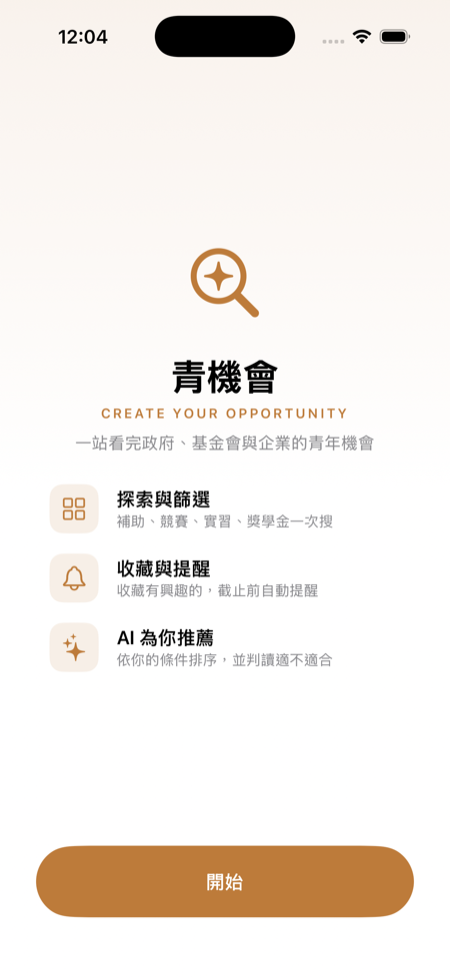
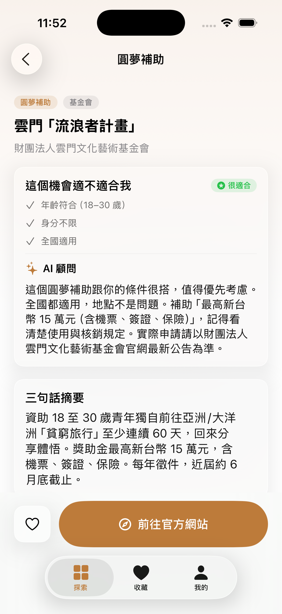
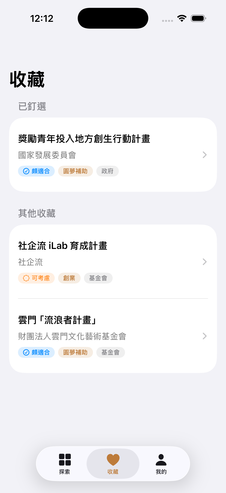
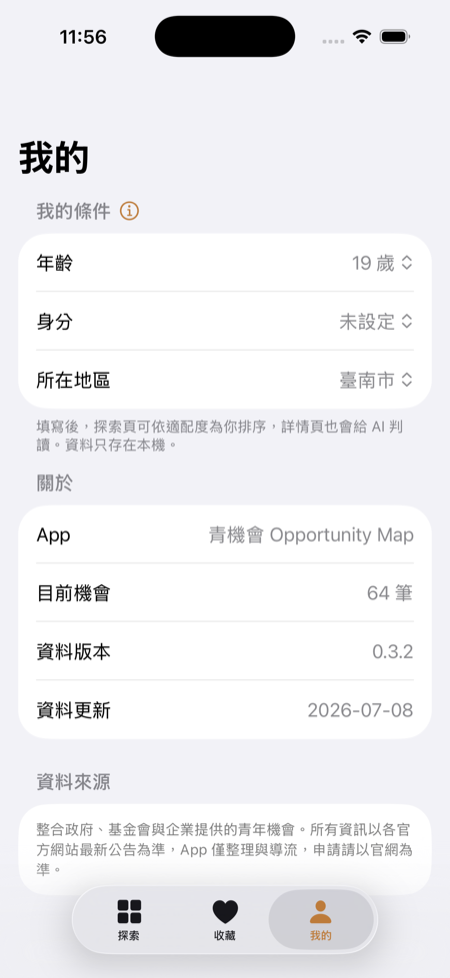
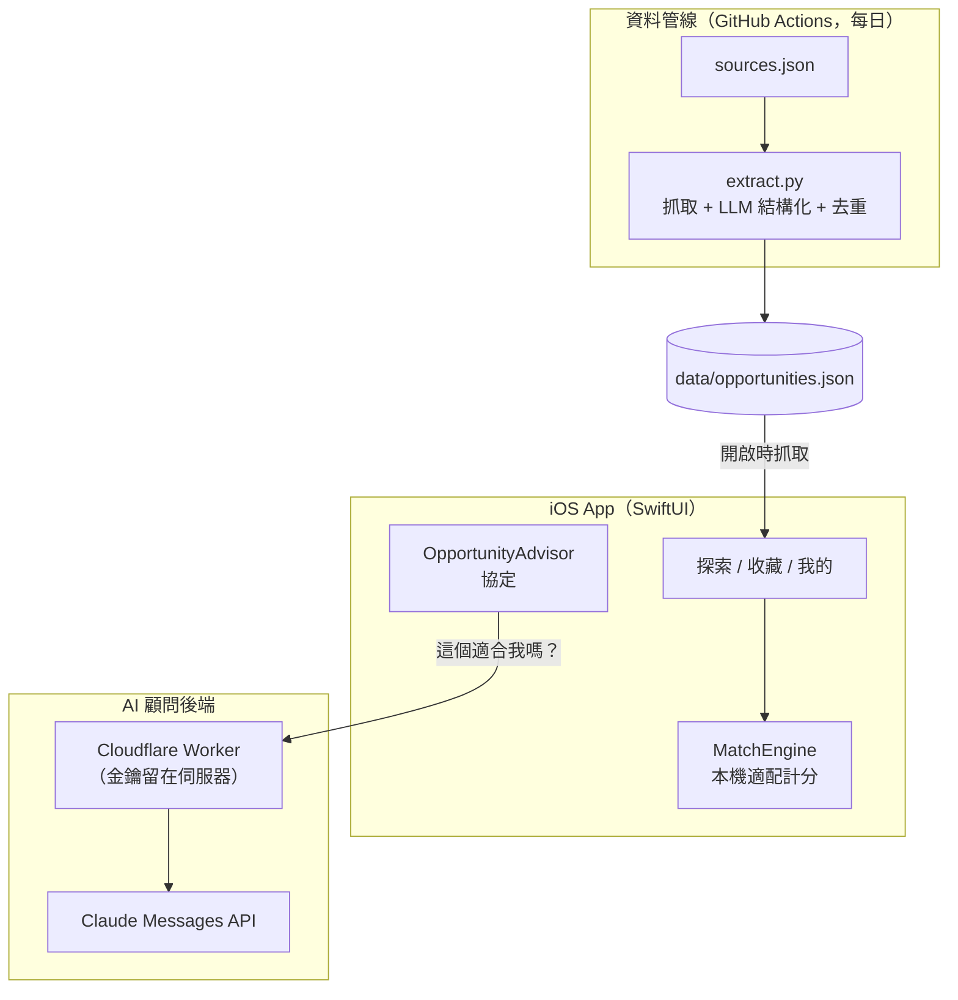
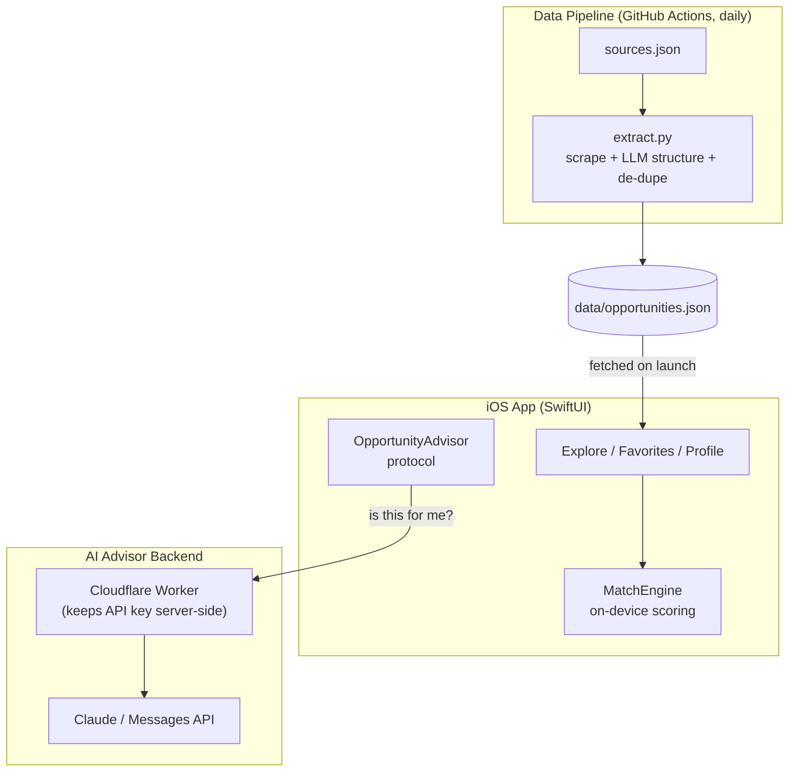

# 青機會 · Youth Opportunity

| Onboarding | Explore | Detail · AI read | Favorites | Profile |
|:--:|:--:|:--:|:--:|:--:|
| <a href="docs/screenshots/onboarding.png"></a> | <a href="docs/screenshots/explore.png"></a> | <a href="docs/screenshots/detail.png"></a> | <a href="docs/screenshots/favorites.png"></a> | <a href="docs/screenshots/profile.png"></a> |

<sub>點任一截圖可放大 · Tap any screenshot to enlarge</sub>

**繁體中文 ｜ [English](#english)**

---

## 繁體中文

一款 iOS App，幫台灣年輕人**發現**散落在數十個官方網站的補助、競賽、獎學金、實習與創業計畫，在本機依你的條件**配對**，再導流到官網申請。

它是一個**發現／聚合**工具，不是申請入口：目標是在五分鐘內回答「**有哪些機會、哪些適合我**」，然後把你帶到官網。

> 以 SwiftUI + SwiftData 打造，含本機適配引擎、可選的 Claude AI 顧問，以及會自我更新的資料管線（Python + Gemini + GitHub Actions）。

### 為什麼做

台灣有上百個青年補助、競賽、獎學金與創業計畫，卻散落在數十個政府、基金會與企業網站，格式各異、資格常埋在 PDF 裡。很多年輕人錯過機會，只因為「不知道有」或「不確定自己符不符合」。

青機會把它們集中、結構化，並告訴你哪些真的適合你——讓「發現」只花五分鐘，而不是一整個下午的分頁地獄。

### 亮點功能

- **本機個人化配對** — 用確定性的引擎，依你的年齡／身分／地區為每個機會計分，標上適配徽章（`很適合 / 頗適合 / 可考慮`），完全離線、不需網路或 API。
- **AI 顧問（選配）** — 每個機會一句「這適不適合我」的判讀，由 Claude 透過後端代理提供；離線時有 `MockAdvisor` 備援，App 隨時零成本可展示。
- **自我更新的資料** — Python 管線抓取官網、用 LLM（Gemini 免費額度）結構化、去重，再透過 GitHub Actions 每日 commit 回 repo。App 開啟時抓最新資料，不需上架更新。
- **SwiftData 收藏** — 釘選置頂、滑動操作，並顯示相同的適配徽章。
- **截止提醒** — 截止前 3 天發本地通知。
- **據點地圖** — 有實體地點的機會會顯示 MapKit 卡片，可用 Apple 或 Google 地圖開啟導航。

### 架構

三塊圍繞一份 JSON「資料庫」協作：



- **① iOS App（MVVM + `@Observable`）** — 資料單向流動：遠端 JSON → `OpportunityService`（抓遠端、失敗回退內建）→ `OpportunityStore`（持有資料／搜尋／篩選）→ 各畫面。
- **② 本機配對** — `MatchEngine.evaluate` 是純函式、確定性：底分 + 年齡硬門檻 + 身分／地區加權 → 適配等級。在本機跑，所以即時、免費、離線可用；網路只用來「更新資料」，不用來「排序」。
- **③ AI 顧問（可抽換）** — `OpportunityAdvisor` 協定有兩種實作：`BackendAdvisor` 打 Cloudflare Worker 代理到 Claude（金鑰不進 App）；`MockAdvisor` 離線用真實資料組句，零成本。`Advisors.default` 自動選擇。
- **④ 資料管線** — `extract.py` 讀 `sources.json`、逐一抓取、交給 LLM 結構化、**依標題去重**（只加新的、不覆蓋手工策展），寫回 `data/opportunities.json`；GitHub Actions 每日跑並自動 commit。LLM 呼叫集中在 `llm_extract` 一個函式，供應商（Gemini / GPT / Claude）可一處抽換。

### 技術棧

| 範圍 | 技術 |
| --- | --- |
| App | Swift、SwiftUI、SwiftData、MapKit、`@Observable`、UserNotifications、Google Mobile Ads (AdMob) |
| AI 顧問 | Claude Messages API（經 Cloudflare Worker 代理） |
| 資料管線 | Python（`requests`、`BeautifulSoup`、`google-genai`）、GitHub Actions |
| 目標平台 | iOS 18+、Xcode 16 |

### 專案結構

```
OpportunityMap/            # iOS App（Xcode 16 資料夾同步）
├── Models/                # Opportunity、UserProfile + MatchEngine、FavoriteOpportunity
├── ViewModels/            # OpportunityStore、ProfileStore、AppRouter（@Observable）
├── Services/              # OpportunityService、RecommendationService、ReminderService
├── Views/                 # 探索、詳情、收藏、我的、Onboarding
└── Utilities/             # 樣式輔助
data/opportunities.json    # App 抓取的「資料庫」
pipeline/                  # extract.py、sources.json（抓取 → LLM → 去重）
backend/worker.js          # Cloudflare Worker（Claude 代理）
.github/workflows/         # 每日資料更新自動化
```

### 執行方式

1. 用 Xcode 16（iOS 18 SDK）開啟 `OpportunityMap.xcodeproj`。
2. 若提示，解析 Swift Package 相依（Google Mobile Ads）。
3. 在 iOS 18 模擬器上 build & run。

不需任何金鑰即可執行：AI 顧問預設走 `MockAdvisor`，廣告用 Google 官方**測試** ID。

### 狀態

核心已完成：發現、本機配對、AI 顧問層、收藏、提醒、據點地圖、Onboarding、每日自我更新的資料管線（已上線）。Roadmap：補齊截止日／金額、擴充來源、部署正式 Claude 後端做即時 AI demo。

### 免責聲明

本 App 聚合並導流至公開的青年計畫。所有資格與截止日以各計畫官方公告為準——申請前請務必至官網確認。

<br>

---
---

<br>

## English

An iOS app that helps young people in Taiwan **discover** grants, competitions, scholarships, internships and startup programs scattered across dozens of official sites — then **matches** each opportunity to them on-device and hands off to the official site to apply.

It is a **discovery / aggregator** app, not an application portal: its job is to answer *"what opportunities exist, and which ones fit me?"* in five minutes, then link out.

> Built with SwiftUI + SwiftData, an on-device eligibility-matching engine, an optional Claude-powered advisor, and a self-updating data pipeline (Python + Gemini + GitHub Actions).

### Why it exists

Taiwan runs hundreds of youth grants, competitions, scholarships and startup programs — but they're scattered across dozens of government, foundation and corporate sites, each with its own format and eligibility often buried in PDFs. Many young people miss opportunities simply because they never knew they existed, or couldn't tell whether they qualified.

青機會 pulls them into one place, structures them, and shows you which ones actually fit — so discovery takes five minutes, not an afternoon of tab-hopping.

### Highlights

- **On-device personalized matching** — a deterministic engine scores every opportunity against the user's age / identity / region and shows a fit badge (`很適合 / 頗適合 / 可考慮`), fully offline, no network or API needed.
- **AI advisor (optional)** — a per-opportunity *"is this for me?"* read powered by Claude through a backend proxy, with an offline `MockAdvisor` fallback so the app is always demoable at zero cost.
- **Self-updating data** — a Python pipeline scrapes official sites, uses an LLM (Gemini free tier) to structure them, de-dupes, and commits back to the repo daily via GitHub Actions. The app pulls the latest data on launch — no App Store update required.
- **Favorites with SwiftData** — pin-to-top, swipe actions, and the same fit badges.
- **Deadline reminders** — local notifications scheduled 3 days before a deadline.
- **Venue map** — opportunities with a physical location show a MapKit card that opens in Apple or Google Maps.

### Architecture

Three cooperating parts around one JSON "database":



- **iOS App (MVVM + `@Observable`)** — data flows one way: remote JSON → `OpportunityService` (fetch remote, fall back to bundled) → `OpportunityStore` (data, search, filters) → the views.
- **On-device matching** — `MatchEngine.evaluate` is pure and deterministic: base score, hard age gate, weighted identity/region bonuses → a fit level. It runs locally, so it's instant, free, and offline — the network only *refreshes the data*, never *ranks* it.
- **AI advisor (pluggable)** — `OpportunityAdvisor` has two implementations: `BackendAdvisor` calls a Cloudflare Worker that proxies to Claude (key never in the app); `MockAdvisor` composes a read from the real data, offline, no API. `Advisors.default` auto-selects.
- **Data pipeline** — `extract.py` reads `sources.json`, scrapes each site, sends the text to an LLM for structured extraction, **de-dupes against the curated data** (only adds new items), and writes back to `data/opportunities.json`; GitHub Actions runs it daily and commits changes. The LLM call is isolated in one function (`llm_extract`) so the provider can be swapped in one place.

### Tech Stack

| Area | Tech |
| --- | --- |
| App | Swift, SwiftUI, SwiftData, MapKit, `@Observable`, UserNotifications, Google Mobile Ads (AdMob) |
| AI advisor | Claude Messages API via a Cloudflare Worker proxy |
| Data pipeline | Python (`requests`, `BeautifulSoup`, `google-genai`), GitHub Actions |
| Target | iOS 18+, Xcode 16 |

### Project Structure

```
OpportunityMap/            # iOS app (Xcode 16 folder-synced)
├── Models/                # Opportunity, UserProfile + MatchEngine, FavoriteOpportunity
├── ViewModels/            # OpportunityStore, ProfileStore, AppRouter (@Observable)
├── Services/              # OpportunityService, RecommendationService, ReminderService
├── Views/                 # Explore, Detail, Favorite, Profile, Onboarding
└── Utilities/             # styling helpers
data/opportunities.json    # the "database" the app fetches
pipeline/                  # extract.py, sources.json  (scrape → LLM → de-dupe)
backend/worker.js          # Cloudflare Worker (Claude proxy)
.github/workflows/         # daily data-update automation
```

### Running it

1. Open `OpportunityMap.xcodeproj` in Xcode 16 (iOS 18 SDK).
2. Resolve the Swift Package dependency (Google Mobile Ads) if prompted.
3. Build & run on an iOS 18 simulator.

No keys required to run: the AI advisor defaults to `MockAdvisor`, and ads use Google's public **test** IDs.

### Status

Core app complete: discovery, on-device matching, AI advisor layer, favorites, reminders, venue maps, onboarding, self-updating data pipeline (live, daily). Roadmap: enrich deadlines/amounts, expand sources, deploy the real Claude backend for a live AI demo.

### Disclaimer

This app aggregates and links to public youth programs. All eligibility and deadlines are subject to each program's official announcement — always confirm on the official site before applying.
