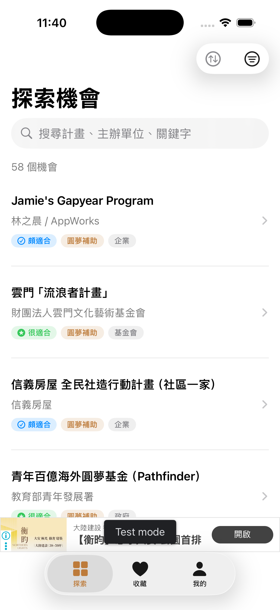
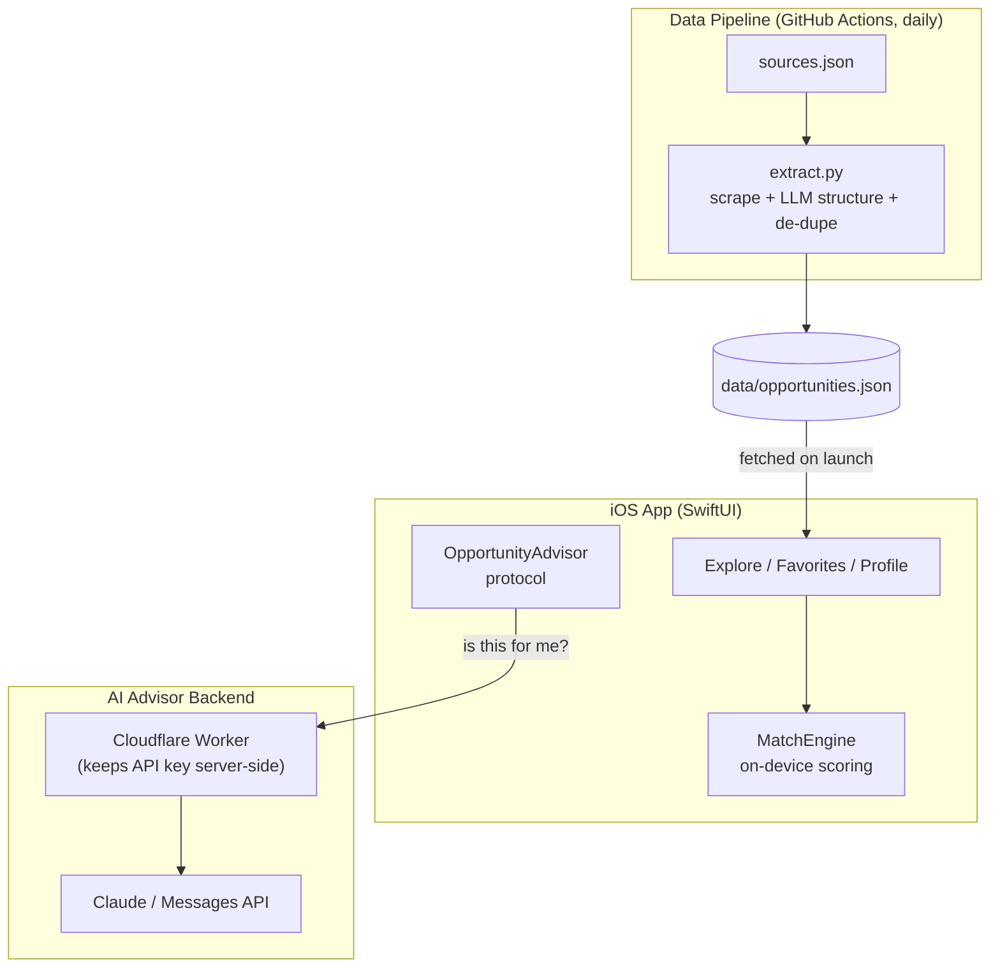

# 青機會 · Youth Opportunity

An iOS app that helps young people in Taiwan **discover** grants, competitions, scholarships, internships and startup programs scattered across dozens of official sites — then **matches** each opportunity to them on-device and hands off to the official site to apply.

It is a **discovery / aggregator** app, not an application portal: its job is to answer *“what opportunities exist, and which ones fit me?”* in five minutes, then link out.

> Built with SwiftUI + SwiftData, an on-device eligibility-matching engine, an optional Claude-powered advisor, and a self-updating data pipeline (Python + Gemini + GitHub Actions).



---

## Highlights

- **On-device personalized matching** — a deterministic engine scores every opportunity against the user’s age / identity / region and shows a fit badge (`很適合 / 頗適合 / 可考慮`), fully offline, no network or API needed.
- **AI advisor (optional)** — a per-opportunity *“is this for me?”* read powered by Claude through a backend proxy, with an offline `MockAdvisor` fallback so the app is always demoable at zero cost.
- **Self-updating data** — a Python pipeline scrapes official sites, uses an LLM (Gemini free tier) to structure them, de-dupes, and commits back to the repo daily via GitHub Actions. The app pulls the latest data on launch — no App Store update required.
- **Favorites with SwiftData** — pin-to-top, swipe actions, and the same fit badges.
- **Deadline reminders** — local notifications scheduled 3 days before a deadline.
- **Venue map** — opportunities with a physical location show a MapKit card that opens in Apple or Google Maps.

---

## Architecture

Three cooperating parts around one JSON “database”:



### 1. iOS App (MVVM + `@Observable`)

Data flows one way, from the remote JSON to the views:

```
data/opportunities.json (remote)
  → OpportunityService   (fetch remote, fall back to bundled copy)
  → OpportunityStore      (@Observable: holds data, search text, filters)
  → ExploreView / FavoritesView / OpportunityDetailView
```

- **Models** — `Opportunity`, `UserProfile` (+ `MatchEngine`), `FavoriteOpportunity` (`@Model`, SwiftData).
- **Stores (view models)** — `OpportunityStore` (list + search + filters), `ProfileStore` (user criteria), `AppRouter` (tab selection). All `@Observable`, injected via the SwiftUI environment.
- **Services** — `OpportunityService` (remote/bundled data), `RecommendationService` (the AI advisor layer), `ReminderService` (local notifications).

### 2. On-device matching

`MatchEngine.evaluate(_:for:)` is pure and deterministic: base score, hard age gate, weighted identity/region bonuses → a `MatchLevel`. Because it runs locally it is instant, free, and works offline — the network is only used to *refresh the data*, never to *rank* it.

### 3. AI advisor (pluggable)

`OpportunityAdvisor` is a protocol with two implementations:
- `BackendAdvisor` → calls a **Cloudflare Worker** that holds the API key and proxies to **Claude** (the key is never in the app).
- `MockAdvisor` → composes a sensible read from the real data, offline, no API — so the app demos fully at zero cost.

`Advisors.default` auto-selects: real backend if configured, otherwise the mock.

### 4. Data pipeline

`pipeline/extract.py` reads `sources.json`, scrapes each site (`requests` + `BeautifulSoup`), sends the text to an LLM for structured extraction, **de-dupes against the existing curated data** (only adds new items, never overwrites), and writes back to `data/opportunities.json`. `.github/workflows/update-data.yml` runs it daily and commits any changes. The LLM call is isolated in one function (`llm_extract`) so the provider (Gemini / GPT / Claude) can be swapped in one place.

---

## Tech Stack

| Area | Tech |
| --- | --- |
| App | Swift, SwiftUI, SwiftData, MapKit, `@Observable`, UserNotifications, Google Mobile Ads (AdMob) |
| AI advisor | Claude Messages API via a Cloudflare Worker proxy |
| Data pipeline | Python (`requests`, `BeautifulSoup`, `google-genai`), GitHub Actions |
| Target | iOS 18+, Xcode 16 |

---

## Project Structure

```
OpportunityMap/            # iOS app (Xcode 16 folder-synced)
├── Models/                # Opportunity, UserProfile + MatchEngine, FavoriteOpportunity
├── ViewModels/            # OpportunityStore, ProfileStore, AppRouter (@Observable)
├── Services/              # OpportunityService, RecommendationService, ReminderService
├── Views/                 # Explore, Detail, Favorite, Profile, Onboarding
└── Utilities/             # styling helpers
data/opportunities.json    # the “database” the app fetches
pipeline/                  # extract.py, sources.json  (scrape → LLM → de-dupe)
backend/worker.js          # Cloudflare Worker (Claude proxy)
.github/workflows/         # daily data-update automation
```

---

## Running it

1. Open `OpportunityMap.xcodeproj` in Xcode 16 (iOS 18 SDK).
2. Resolve the Swift Package dependency (Google Mobile Ads) if prompted.
3. Build & run on an iOS 18 simulator.

No keys required to run: the AI advisor defaults to `MockAdvisor`, and ads use Google’s public **test** IDs.

---

## Status

Core app complete: discovery, on-device matching, AI advisor layer, favorites, reminders, venue maps, onboarding, self-updating data pipeline (live, daily). Roadmap: enrich deadlines/amounts, expand sources, deploy the real Claude backend for a live AI demo.

## Disclaimer

This app aggregates and links to public youth programs. All eligibility and deadlines are subject to each program’s official announcement — always confirm on the official site before applying.
